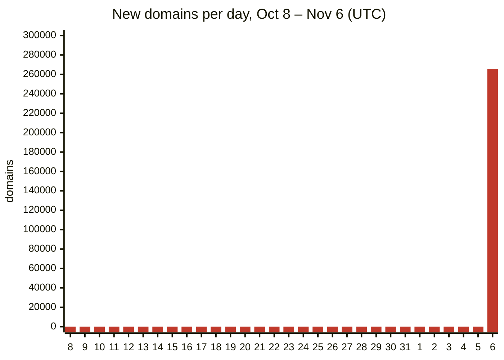
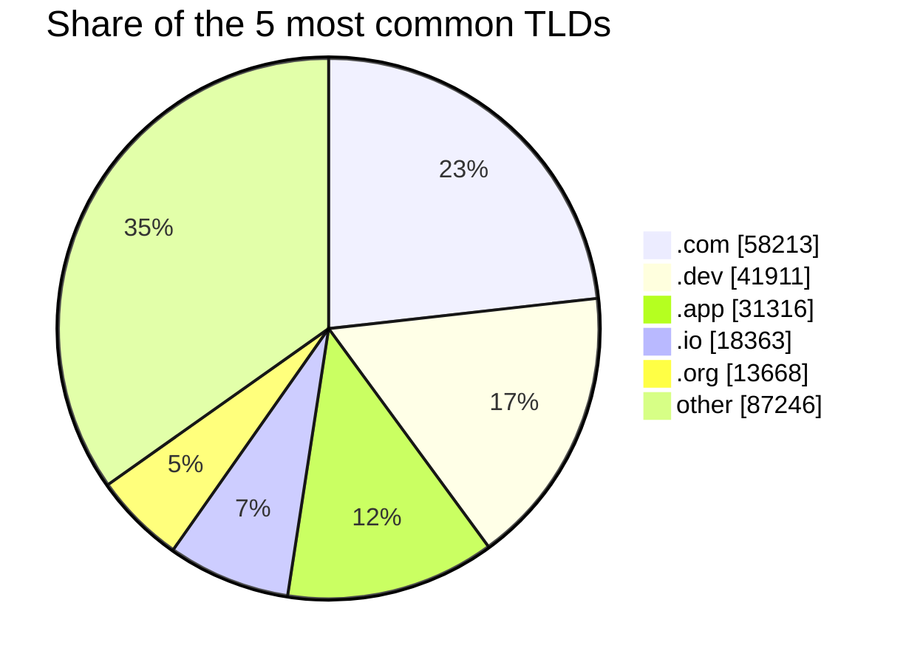

# xRuffKez CTI (Cyber Threat Intelligence)

   

A continuously maintained blocklist of **active malicious domains**: phishing, malware delivery, scams, fraudulent shops and investment schemes, and the infrastructure behind them. Every entry is verified before it is published, and removed again once it is offline or no longer malicious, so the list stays current instead of growing forever.

> [!TIP]
> Subscribe to one of the files below in your DNS filter, ad blocker or resolver. The lists are refreshed several times per hour; polling every 1 to 6 hours is plenty.

## At a glance

<sub>as of 2026-11-06 19:57 UTC</sub>

| | |
|---|---:|
| Active domains | **250,717** |
| Added in the last 24 hours | 265,824 |
| Added in the last 7 days | 265,824 |
| Added in the last 30 days | 265,824 |
| Retired in the last 30 days (offline or cleaned up) | 5,601 |
| Top-level domains represented | 476 |
| Internationalized (IDN / punycode) domains | 0.1 % |
| Domains containing digits | 46.2 % |
| Domains containing hyphens | 48.3 % |
| Average domain length | 26.9 characters |

## Activity, last 30 days


```mermaid
%%{init: {"themeVariables": {"xyChart": {"plotColorPalette": "#c0392b"}}}}%%
xychart-beta
    title "New domains per day, Oct 8 – Nov 6 (UTC)"
    x-axis ["8", "9", "10", "11", "12", "13", "14", "15", "16", "17", "18", "19", "20", "21", "22", "23", "24", "25", "26", "27", "28", "29", "30", "31", "1", "2", "3", "4", "5", "6"]
    y-axis "domains" 0 --> 300000
    bar [0, 0, 0, 0, 0, 0, 0, 0, 0, 0, 0, 0, 0, 0, 0, 0, 0, 0, 0, 0, 0, 0, 0, 0, 0, 0, 0, 0, 0, 265824]
```

<details><summary>Last 7 days as a table</summary>

| Day (UTC) | Added | Retired |
|---|---:|---:|
| 2026-11-06 | 265,824 | 5,601 |
| 2026-11-05 | 0 | 0 |
| 2026-11-04 | 0 | 0 |
| 2026-11-03 | 0 | 0 |
| 2026-11-02 | 0 | 0 |
| 2026-11-01 | 0 | 0 |
| 2026-10-31 | 0 | 0 |

</details>

## Top-level domains

| # | TLD | Domains | Share | |
|---:|---|---:|---:|---|
| 1 | `.com` | 58,213 | 23.2 % | ████████████████████ |
| 2 | `.dev` | 41,911 | 16.7 % | ██████████████ |
| 3 | `.app` | 31,316 | 12.5 % | ███████████ |
| 4 | `.io` | 18,363 | 7.3 % | ██████ |
| 5 | `.org` | 13,668 | 5.5 % | █████ |
| 6 | `.click` | 11,484 | 4.6 % | ████ |
| 7 | `.digital` | 9,385 | 3.7 % | ███ |
| 8 | `.top` | 4,463 | 1.8 % | ██ |
| 9 | `.sbs` | 4,242 | 1.7 % | █ |
| 10 | `.xyz` | 4,071 | 1.6 % | █ |
| 11 | `.cc` | 4,064 | 1.6 % | █ |
| 12 | `.net` | 3,739 | 1.5 % | █ |
| 13 | `.info` | 3,485 | 1.4 % | █ |
| 14 | `.me` | 3,022 | 1.2 % | █ |
| 15 | `.link` | 2,294 | 0.9 % | █ |


```mermaid
pie showData title Share of the 5 most common TLDs
    ".com" : 58213
    ".dev" : 41911
    ".app" : 31316
    ".io" : 18363
    ".org" : 13668
    "other" : 87246
```

## Most imitated brands

Listed domains whose name contains a well-known brand. Brand names are trademarks of their owners; the brands themselves are of course not listed.

| Brand | Domains | |
|---|---:|---|
| Coinbase | 3,601 | ████████████████████ |
| MetaMask | 3,292 | ██████████████████ |
| Meta / Facebook | 1,839 | ██████████ |
| Amazon | 1,696 | █████████ |
| WhatsApp | 1,604 | █████████ |
| Microsoft / Office 365 | 1,380 | ████████ |
| Google | 1,342 | ███████ |
| Instagram | 1,253 | ███████ |
| Netflix | 1,197 | ███████ |
| PayPal | 1,107 | ██████ |
| Apple / iCloud | 1,099 | ██████ |
| Ledger | 1,032 | ██████ |
| OpenSea | 796 | ████ |
| Trust Wallet | 246 | █ |
| TikTok | 208 | █ |

## Most common lure words

| Word | Domains | |
|---|---:|---|
| `login` | 5,399 | ████████████████████ |
| `wallet` | 3,052 | ███████████ |
| `auth` | 2,379 | █████████ |
| `support` | 2,274 | ████████ |
| `help` | 2,224 | ████████ |
| `account` | 2,028 | ████████ |
| `service` | 1,976 | ███████ |
| `secure` | 1,689 | ██████ |
| `update` | 1,287 | █████ |
| `claim` | 1,236 | █████ |
| `connect` | 911 | ███ |
| `invest` | 691 | ███ |

## Files

| File | Format | Use it with |
|---|---|---|
| [`domains.txt`](https://raw.githubusercontent.com/DNSBunker/CTI/main/domains.txt) | one domain per line | Technitium, Blocky, dnsmasq/Unbound scripts, firewalls, SIEM enrichment |
| [`adblock.txt`](https://raw.githubusercontent.com/DNSBunker/CTI/main/adblock.txt) | `\|\|domain^` | AdGuard Home, Pi-hole v6, uBlock Origin, AdGuard, NextDNS-style filters |
| [`rpz.txt`](https://raw.githubusercontent.com/DNSBunker/CTI/main/rpz.txt) | DNS Response Policy Zone | BIND, Unbound, Knot Resolver, PowerDNS Recursor |

Each entry covers the domain **and all of its subdomains**. On shared hosting and cloud platforms only the individual malicious hostname is listed, never the platform itself.

<details><summary><b>AdGuard Home / Pi-hole</b></summary>

AdGuard Home: *Filters → DNS blocklists → Add blocklist → Add a custom list* and enter

```
https://raw.githubusercontent.com/DNSBunker/CTI/main/adblock.txt
```

Pi-hole v6: *Lists → Add a new subscribed list* with the same URL (the adblock format also blocks subdomains).

</details>

<details><summary><b>uBlock Origin / AdGuard browser extension</b></summary>

[Subscribe with one click](https://subscribe.adblockplus.org/?location=https%3A%2F%2Fraw.githubusercontent.com%2FDNSBunker%2FCTI%2Fmain%2Fadblock.txt&title=xRuffKez%20CTI%20%28Cyber%20Threat%20Intelligence%29), or add the URL under *Filter lists → Import*:

```
https://raw.githubusercontent.com/DNSBunker/CTI/main/adblock.txt
```

</details>

<details><summary><b>Unbound (RPZ)</b></summary>

```yaml
rpz:
    name: cti.rpz
    url: https://raw.githubusercontent.com/DNSBunker/CTI/main/rpz.txt
    rpz-action-override: nxdomain
    rpz-log: yes
    rpz-log-name: cti
```

</details>

<details><summary><b>BIND 9 (RPZ)</b></summary>

Fetch the zone periodically, e.g. hourly from cron:

```sh
curl -fsS -o /var/named/cti.rpz.tmp https://raw.githubusercontent.com/DNSBunker/CTI/main/rpz.txt && mv /var/named/cti.rpz.tmp /var/named/cti.rpz && rndc reload cti.rpz
```

```
zone "cti.rpz" { type primary; file "/var/named/cti.rpz"; };
options { response-policy { zone "cti.rpz"; }; };
```

</details>

<details><summary><b>Knot Resolver / PowerDNS Recursor</b></summary>

Knot Resolver 5:

```lua
policy.add(policy.rpz(policy.DENY, '/etc/knot-resolver/cti.rpz', true))
```

PowerDNS Recursor (Lua config):

```lua
rpzFile("/etc/powerdns/cti.rpz", {defpol=Policy.NXDOMAIN})
```

Download the zone file as shown for BIND.

</details>

## Listing policy

- **Verified before listing.** A domain is published only after it has been confirmed as active and malicious; suspicious-looking names alone are not enough.
- **Continuously re-verified.** Entries that go offline or are no longer malicious are removed automatically. The list reflects current threats, not history.
- **Precise.** Shared platforms (hosting, cloud, CDN, dynamic DNS) are never listed as a whole; only the individual hostname is.
- **Protected services.** Well-known legitimate services are on an allowlist and are never listed.

## False positives

Found a legitimate domain on the list? Please [open an issue](https://github.com/DNSBunker/CTI/issues/new?title=False%20positive%3A%20) with the domain and a short note why it is legitimate. Reports are reviewed with priority, and a confirmed false positive is removed from every file with the next update.

## Privacy

This project does not collect, store or publish any user data, queries or network metadata.

>[!NOTE]
>DNSBunker.org Resolvers User Data and Queries are NOT used by this CTI project by any means!

## License

[GNU General Public License v2.0](https://www.gnu.org/licenses/old-licenses/gpl-2.0.html)  
Copyright (C) DNSBunker.org / xRuffKez  
SPDX-License-Identifier: GPL-2.0-only

---

Project: [dnsbunker.org](https://dnsbunker.org) · Repository: [github.com/DNSBunker/CTI](https://github.com/DNSBunker/CTI)
